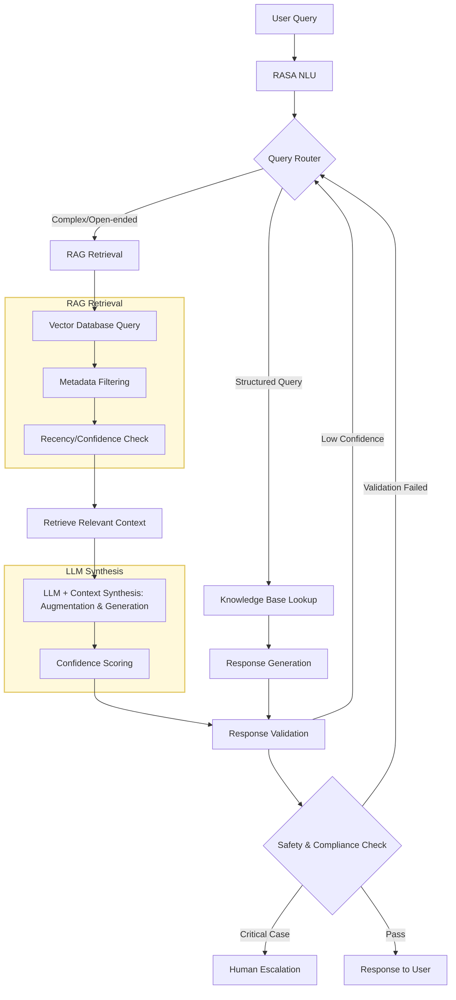

## LLM-and-RAG-Powered-MedBot

An advanced RASA-based medical chatbot with Retrieval-Augmented Generation (RAG) capabilities, providing intelligent symptom assessment, medication guidance, mental health support, and chronic disease management with source attribution and safety validation. Supported by LLM  for handling ambiguous queries beyond the Knowledge Base and generating dynamic responses, and RAG for solving the limitations of LLM like hallucinations and outdated data.


## Data Sources for RAG: Hybrid Knowledge Base
1. Structured Medical Knowledge
- DrugBank API: Medication interactions & side effects
- CDC Guidelines: Prevention & treatment protocols
- PubMed Abstracts: Latest research findings
- WHO Disease Guidelines: International standards

2. Unstructured Data Processing
- PDF, JSON, Text files Parsing and Extraction

3. Real-time API Integration with Medical Knowledge Bases
   
MEDICAL_APIS = {

    "drug_interactions": "https://api.drugbank.com/v1/interactions",
    
    "symptom_checker": "https://api.infermedica.com/v3/diagnosis",
    
    "clinical_guidelines": "https://clinicaltrials.gov/api/v2/studies"
    
}


## RASA Chatbot with LLM Integration: Architecture (Before RAG integration)


## Retrieval Augmented Generation(RAG) Integration

 RAG is built with the following capabilities to solve the Key LLM limitations:

- ✅ **Eliminates Hallucinations**: Grounds responses in verified medical sources
- ✅ **Up-to-Date Information**: Dynamic retrieval from latest medical databases  
- ✅ **Traceability**: Every response references its source (CDC, DrugBank, internal KB)
- ✅ **Customization**: Blend general medical knowledge with proprietary guidelines.

### ✅ **Key Features**
- **Intelligent Query Routing**: Dynamically classifies and routes queries with metadata filters
- **Vector-Based Retrieval**: Semantic search with MMR and reranking for relevance
- **Emergency Detection**: Real-time identification with prioritized escalation
- **Source Attribution**: Verifiable sources with confidence scores in every response
- **Multi-Layer Safety Validation**: Pre- and post-generation checks with disclaimers
- **Confidence Scoring**: Quantified trust levels for informed decision-making


## Final Workflow:



## Key Workflows:

1. Precision First:
    Critical queries (e.g., drug interactions) that are structured(basis NLU intent/entity detection using regex)are answered directly from the KB.

    Example:
    In `actions.py`:  
    if user_query == "aspirin and ibuprofen interaction":  
        return KB["aspirin"]["interactions"]["ibuprofen"]

2. RAG Retrieval Process
   Handles complex queries with semantic search and metadata filtering (e.g., recency, category).

3. LLM Augmentation with RAG
    For complex or open-ended questions (e.g., "How to manage diabetes?"), LLM elaborates using retrieved context.

    Example prompt:
    "Based on [KB_Diabetes_Guide], list 3 diet tips for diabetes. Use simple language."  

4. Enhanced Validation Layer before final reponse generation:
    Validates responses for safety, adds disclaimers, and checks source credibility.
    Why?: Ensures compliance and accuracy which is very crucial thing in the health/medicine domain, while using AI assistants. 
    (e.g.,
    
    if llm_response not in KB["allowed_advice"]:  
        return "Consult a doctor."
    )

## Example Workflows:

Case 1: Medication Interaction (Structured + RAG)

```python
# User: "Can I take aspirin with warfarin?"
# Step 1: Structured KB lookup
kb_result = MEDICAL_KB["interactions"].get(("aspirin", "warfarin"))

# Step 2: If not in KB, RAG retrieval
if not kb_result:
    context = retrieve_medical_context(
        "aspirin warfarin interaction", 
        {"medication": ["aspirin", "warfarin"]}
    )
    
# Step 3: LLM synthesis
response = generate_rag_response(
    "aspirin and warfarin interaction", 
    context
)

# Response: "According to DrugBank: Aspirin may increase the anticoagulant effect of warfarin, increasing bleeding risk. Sources: DrugBank 2024, PubMed Study 2023"
```

Case 2: Emerging Health Topic (RAG-Primary)

```python
# User: "Latest treatment for long COVID?"
# Step 1: RAG retrieval from latest sources
context = retrieve_medical_context(
    "long COVID treatment guidelines 2024",
    {"condition": "long COVID", "category": "treatment"}
)

# Step 2: LLM synthesis with recency filter
response = generate_rag_response(
    "current long COVID treatment protocols",
    filter_by_recency(context, max_days=180)  # Last 6 months
)

# Response: "According to WHO 2024 guidelines: Graduated exercise therapy and cognitive behavioral therapy show efficacy. Sources: WHO Guidelines 2024, NIH Bulletin 2025"
```

Case 3: Multi-faceted Query (Hybrid Approach)
```python
# User: "Diabetes management with kidney complications"
# Step 1: Structured KB for basics
kb_diabetes = MEDICAL_KB["chronic_conditions"]["diabetes"]["management"]
kb_kidney = MEDICAL_KB["complications"]["kidney"]

# Step 2: RAG for a specific combination
context = retrieve_medical_context(
    "diabetes nephropathy management",
    {"condition": ["diabetes", "kidney disease"]}
)

# Step 3: Combined response
response = combine_kb_and_rag(kb_diabetes, kb_kidney, context)

# Response: "According to DrugBank: Aspirin may increase the anticoagulant effect of warfarin, increasing bleeding risk. Sources: DrugBank 2024, PubMed Study 2023"
```

Case 2: Emerging Health Topic (RAG-Primary)

```python
# User: "Latest treatment for long COVID?"
# Step 1: RAG retrieval from latest sources
context = retrieve_medical_context(
    "long COVID treatment guidelines 2024",
    {"condition": "long COVID", "category": "treatment"}
)

# Step 2: LLM synthesis with recency filter
response = generate_rag_response(
    "current long COVID treatment protocols",
    filter_by_recency(context, max_days=180)  # Last 6 months
)

# Response: "According to WHO 2024 guidelines: Graduated exercise therapy and cognitive behavioral therapy show efficacy. Sources: WHO Guidelines 2024, NIH Bulletin 2025"
```

Case 3: Multi-faceted Query (Hybrid Approach)
```python
# User: "Diabetes management with kidney complications"
# Step 1: Structured KB for basics
kb_diabetes = MEDICAL_KB["chronic_conditions"]["diabetes"]["management"]
kb_kidney = MEDICAL_KB["complications"]["kidney"]

# Step 2: RAG for a specific combination
context = retrieve_medical_context(
    "diabetes nephropathy management",
    {"condition": ["diabetes", "kidney disease"]}
)

# Step 3: Combined response
response = combine_kb_and_rag(kb_diabetes, kb_kidney, context)
```


## 🔧 **Quick Setup**

### 1. Install Dependencies
Ensure you have Python 3.9+ installed. Then run:
```bash
pip install -r requirements.txt
```

Install the Spacy English model manually:
```bash
python -m spacy download en_core_web_md
```
or use the provided wheel file from the requirements.txt link.


### 2. Install Dependencies
```bash
pip install -r requirements.txt
```

### 3. Set up Environment Variables
```bash
DEEPSEEK_API_KEY=your-deepseek-api-key
PINECONE_API_KEY=your-pinecone-api-key
OPENAI_API_KEY=your-openai-api-key
```
Load them in your shell or let python-dotenv handle it.

### 4. Initialize the Vector Store
Populate the Pinecone vector store with your knowledge base:
```bash
python rag/ingestion/ingestion.py
```
Ensure knowledge_base/ contains your medical data (e.g., med_knowledge.json).

### 5. Run Tests
Verify core RAG components:
```bash
python tests/test_core_components.py
```
Fix any failures by adjusting mock data or code as needed.

### 6. Start the Chatbot
```bash
# Terminal 1: Start RASA Action Server
rasa run actions

# Terminal 2: Start Chatbot Interface  
rasa shell
```
